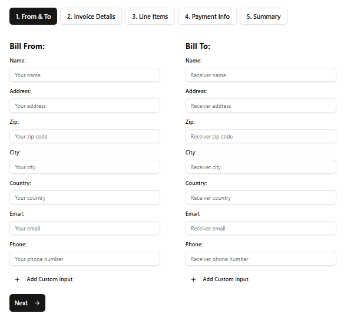

# Invoice Generator

A modern, client-side invoice generator built with React and TypeScript. 

Fill in your details, customize line items, and print or export a clean PDF invoice.



---

## Features

- **Sender & Receiver** — Enter full contact details for both parties, including custom fields
- **Line Items** — Add, edit, and reorder items via drag-and-drop
- **Adjustments** — Optional discount, tax, and shipping with fixed or percentage modes
- **Payment Information** — Include bank name, account name, and account number
- **Logo Upload** — Attach a company logo directly to the invoice
- **Total in Words** — Automatically writes the total amount out in words
- **Live Preview** — See the formatted invoice update in real time
- **Print / Export PDF** — Print or save as PDF directly from the browser
- **Import / Export JSON** — Save and reload invoice data as JSON
- **Internationalization** — Multilanguage supported
- **Form Validation** — Zod-powered validation with descriptive error messages

---

## Technologies

| Library | Purpose |
|---|---|
| [React 19](https://react.dev) | UI framework |
| [TypeScript](https://www.typescriptlang.org) | Type safety |
| [Vite](https://vite.dev) | Build tool & dev server |
| [Tailwind CSS v4](https://tailwindcss.com) | Styling |
| [shadcn/ui](https://ui.shadcn.com) + [Radix UI](https://www.radix-ui.com) | Accessible UI components |
| [Zod](https://zod.dev) | Schema validation |
| [i18next](https://www.i18next.com) + react-i18next | Internationalization |
| [@dnd-kit](https://dndkit.com) | Drag-and-drop line item sorting |
| [react-to-print](https://github.com/MatthewHerbst/react-to-print) | Print / PDF export |
| [number-to-words](https://github.com/nicolo-ribaudo/number-to-words) | Amount in words |

---

## Getting Started

### Prerequisites

- [Node.js](https://nodejs.org) 18+
- npm, pnpm, or yarn

### Installation

```bash
git clone https://github.com/dpieve/invoice-generator.git
cd invoice-generator
npm install
```

### Development

```bash
npm run dev
```

Open [http://localhost:5173](http://localhost:5173) in your browser.

### Build

```bash
npm run build
```

The output will be in the `dist/` folder.

---

## License

MIT License — see [LICENSE](LICENSE) for details.
